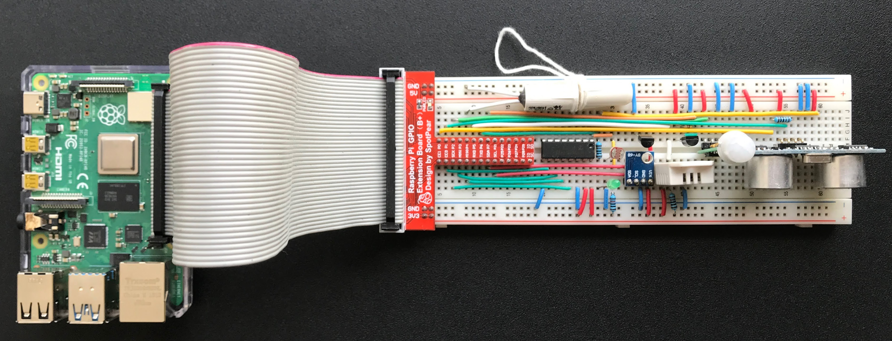

# Lesson 2: Raspberry Pi
* [Raspberry Pi](https://en.wikipedia.org/wiki/Raspberry_Pi)
* [Raspberry Pi OS](https://en.wikipedia.org/wiki/Raspberry_Pi_OS)
* [GNU](https://en.wikipedia.org/wiki/GNU)
* [Linux](https://en.wikipedia.org/wiki/Linux)
* [Debian](https://en.wikipedia.org/wiki/Debian)
* [Command-line interface](https://en.wikipedia.org/wiki/Command-line_interface) (CLI)
* [LXDE](https://en.wikipedia.org/wiki/LXDE)
## Lab 2A:  [General-purpose input/output](https://en.wikipedia.org/wiki/General-purpose_input/output) (GPIO) and [serial communication](https://en.wikipedia.org/wiki/Serial_communication)

### 1. Open a Terminal on macOS/Linux or [Git Bash](https://gitforwindows.org/) on Windows, and make sure Serial Council is disabled
```sh
$ sudo nano /boot/cmdline.txt
```
* Delete "console=serial0,115200" if found
* Save the file with control-x y enter
```sh
$ sudo reboot
```

### 2. Serial [loopback](https://en.wikipedia.org/wiki/Loopback) test
* Connect two serial pins (the 4th and 5th pins from the left of the top row) using one DuPont female-to-female [jump wires](https://en.wikipedia.org/wiki/Jump_wire)

* Install and run [Minicom](https://en.wikipedia.org/wiki/Minicom)
```sh
$ sudo apt-get install minicom
$ minicom -b 115200 -o -D /dev/ttyS0
```
* Enable new line
```sh
control-a a
hello
```
* Enable echo
```sh
control-a e
hheelllloo
```
* Exit Minicom
```sh
control-a x
```

### 3. Optionally, perform serial test between two Raspberry Pi's using three DuPont female-to-female jump wire
* Connect TX of a Raspberry Pi to RX of the other Raspberry Pi
* Connect RX of a Raspberry Pi to TX of the other Raspberry Pi
* Connect GND of both Raspberry Pi's
```sh
$ minicom -b 115200 -o -D /dev/ttyS0
```
* Enable new line and echo
```sh
control-a a
control-a e
hello
```
* Exit Minicom
```sh
control-a x
```

## Lab 2B: [Serial peripheral interface](https://en.wikipedia.org/wiki/Serial_Peripheral_Interface) (SPI)

* Connect the SPI MOSI and MISO pins (the 10th and 11th pins from the left of the bottom row) using one DuPont female-to-female jump wire
* Enter the following three commands on a Terminal:
```sh
$ wget https://raw.githubusercontent.com/raspberrypi/linux/rpi-3.10.y/Documentation/spi/spidev_test.c
$ gcc -o spidev_test spidev_test.c
$ ./spidev_test -D /dev/spidev0.0
spi mode: 0
bits per word: 8
max speed: 500000 Hz (500 KHz)

FF FF FF FF FF FF 
40 00 00 00 00 95 
FF FF FF FF FF FF 
FF FF FF FF FF FF 
FF FF FF FF FF FF 
DE AD BE EF BA AD 
F0 0D 
```

## Lab 2C: [Breadboard](https://en.wikipedia.org/wiki/Breadboard)



### 1. Shorter lead (−) of the LED to a 330-Ω resistor then to Ground, the 3rd pin from the left of the top row

### 2. Longer lead (+) of the LED to GPIO 18, the 6th pin from the left of the top row


## Lab 2D: [Light-emitting diode](https://en.wikipedia.org/wiki/Light-emitting_diode) (LED)

### 1. Connect an LED on a breadboard to the Raspberry Pi GPIO using two DuPont male-to-female jump wires as shown in Lab C

### 2. On a Terminal, enter the following commands to switch an LED on/off 
```sh
pi@raspberypi:~ $ sudo su
root@raspberypi:/home/pi# echo 18 > /sys/class/gpio/export
root@raspberypi:/home/pi# cd /sys/class/gpio/gpio18
root@raspberypi:/sys/class/gpio/gpio18# echo out > direction
root@raspberypi:/sys/class/gpio/gpio18# echo 1 > value
root@raspberypi:/sys/class/gpio/gpio18# echo 0 > value
root@raspberypi:/sys/class/gpio/gpio18# cd /home/pi
root@raspberypi:/home/pi# echo 18 > /sys/class/gpio/unexport
root@raspberypi:/home/pi# exit
```

## Lab 2E: [Inter-integrated circuit](https://en.wikipedia.org/wiki/I%C2%B2C) (I2C)

* Install i2c-tools, and test I2C addresses
* Connect I2C device ADXL345 (3-axis accelerometer) to 3V3, GND, SDA, and SCL of a Raspberry Pi using four DuPont female-to-female jump wires


```sh
$ sudo apt-get install i2c-tools python-smbus
$ sudo i2cdetect -y 1
   0  1  2  3  4  5  6  7  8  9  a  b  c  d  e  f
00:          -- -- -- -- -- -- -- -- -- -- -- -- -- 
10: -- -- -- -- -- -- -- -- -- -- -- -- -- -- -- -- 
20: -- -- -- -- -- -- -- -- -- -- -- -- -- -- -- -- 
30: -- -- -- -- -- -- -- -- -- -- -- -- -- -- -- -- 
40: -- -- -- -- -- -- -- -- -- -- -- -- -- -- -- -- 
50: -- -- -- 53 -- -- -- -- -- -- -- -- -- -- -- -- 
60: -- -- -- -- -- -- -- -- -- -- -- -- -- -- -- -- 
70: -- -- -- -- -- -- -- -- 
```
* Connect I2C device BMP180 (barometric pressure sensor) to 3V3, GND, SDA, and SCL of a Raspberry Pi using four DuPont female-to-female jump wires


```sh
$ sudo i2cdetect -y 1
   0  1  2  3  4  5  6  7  8  9  a  b  c  d  e  f
00:          -- -- -- -- -- -- -- -- -- -- -- -- -- 
10: -- -- -- -- -- -- -- -- -- -- -- -- -- -- -- -- 
20: -- -- -- -- -- -- -- -- -- -- -- -- -- -- -- -- 
30: -- -- -- -- -- -- -- -- -- -- -- -- -- -- -- -- 
40: -- -- -- -- -- -- -- -- -- -- -- -- -- -- -- -- 
50: -- -- -- -- -- -- -- -- -- -- -- -- -- -- -- -- 
60: -- -- -- -- -- -- -- -- -- -- -- -- -- -- -- -- 
70: -- -- -- -- -- -- -- 77 
```

## Lab 2F: [1-Wire](https://en.wikipedia.org/wiki/1-Wire)

### Connect DS18B20 to Raspberry Pi as follows:

* GND to GND
* VDD to 3.3V or 5V
* DQ to GPIO 4 (the 4th pin from the left of the bottom row) and through a 4.7kΩ resistor to VDD


```sh
pi@raspberrypi:~ $ sudo modprobe w1-gpio
pi@raspberrypi:~ $ sudo modprobe w1-therm
pi@raspberrypi:~ $ cd /sys/bus/w1/devices
pi@raspberrypi:/sys/bus/w1/devices $ ls
28-0000064dc293  w1_bus_master1
pi@raspberrypi:/sys/bus/w1/devices $ cd 28*
pi@raspberrypi:/sys/bus/w1/devices/28-0000064dc293 $ cat w1_slave
8f 01 4b 46 7f ff 01 10 14 : crc=14 YES
8f 01 4b 46 7f ff 01 10 14 t=24937
pi@raspberrypi:/sys/bus/w1/devices/28-0000064dc293 $ cd
pi@raspberrypi:~ $ 
```

## Lab 2G: USB [Webcam](https://en.wikipedia.org/wiki/Webcam)

### Connect a USB webcam, install fswebcam, and save images:
```sh
$ sudo apt update
$ sudo apt install fswebcam
$ fswebcam image.jpg
$ fswebcam -r 1280x720 image2.jpg
$ fswebcam -r 1280x720 --no-banner image3.jpg
```
